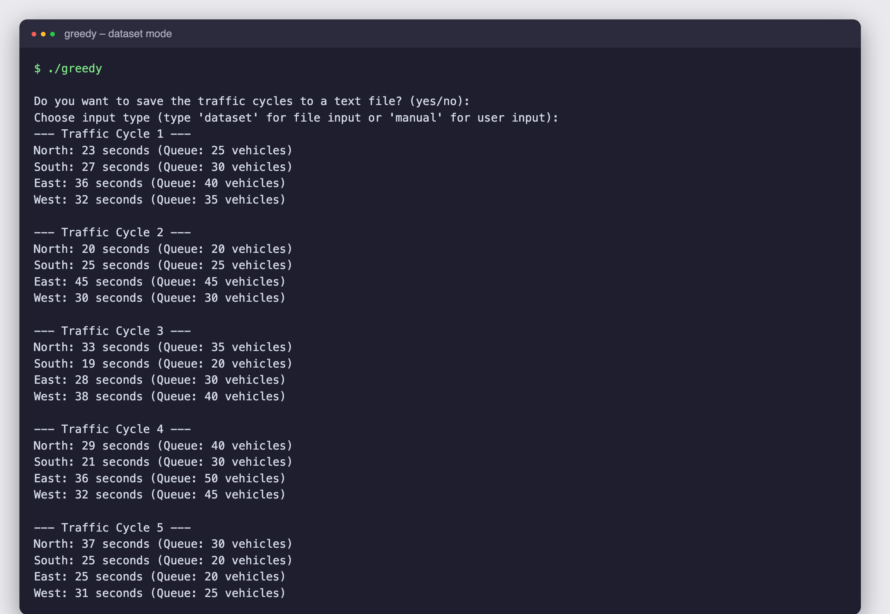
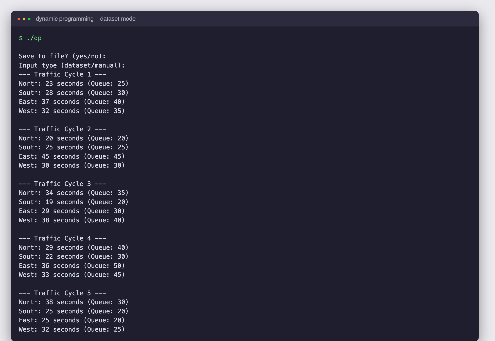
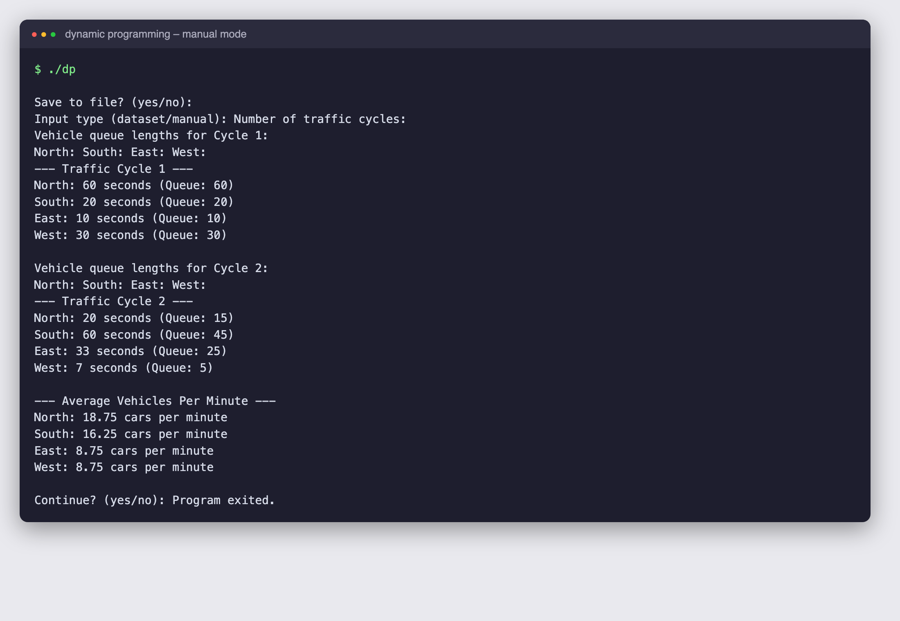

# Traffic Light Scheduling System

An adaptive traffic-signal scheduler that decides how long each of four approaches (North, South, East, West) should get a green light, based on how many vehicles are queued on each. It runs as a terminal simulation and accepts either a CSV dataset or manually typed queue lengths.

> This repository documents the project (description, design, screenshots). The source code lives in a private repository.

## Screenshots

| Greedy + priority (CSV dataset) | Dynamic programming (CSV dataset) |
|---|---|
|  |  |



## What it does

- Simulates repeated signal cycles; each cycle has a fixed total of **120 seconds** of green to share between the four directions.
- Two interchangeable schedulers: **greedy with priority** and **dynamic programming**.
- Input from `traffic_input.csv` (one row per cycle: `North,South,East,West`) or typed in manually.
- Optionally saves every cycle to `traffic_report.txt`.
- Prints the average vehicles per minute for each direction at the end, then offers to run again.
- A companion YOLOv3 script (not part of the C programs) can build `traffic_input.csv` by counting vehicles in camera footage for each direction.

## How it works

### 1. Greedy with priority scheduling
Green time is proportional to demand: `green = (queue / total queue) x 120 s`. Busier approaches have higher priority and receive more time, while quiet ones still get a base share. It is O(1) per cycle and gives fast, approximately fair splits (e.g. queues 25/30/40/35 produce 23/27/36/32 s).

### 2. Dynamic programming
Proportional shares are fractional, but signals run in whole seconds. The DP picks integer allocations that always sum to exactly 120 s while minimising the total squared error against the ideal fractional times:

```
cost = sum_i (allocated_i - exact_i)^2
dp[i][t] = min over a in [0..t] of dp[i-1][t-a] + (a - exact_i)^2
```

It fills a table for 4 lanes x 121 time values, then walks it backwards to read off each lane's allocation (a small knapsack-style problem, O(directions x T^2) with T = 120).

### Reading the screenshots
Cycle 1 has queues 25/30/40/35 (130 vehicles). The greedy scheduler gives 23/27/36/32 s; the DP gives 23/28/37/32 s, which uses the leftover seconds where they reduce error most.

## Tech stack
C (GCC), CSV input, terminal UI. Optional: Python + YOLOv3 for dataset generation.

## Authors
Karthik B, Priyanka G, Adharsh Ramakrishnan. Licensed under GPL-3.0.
